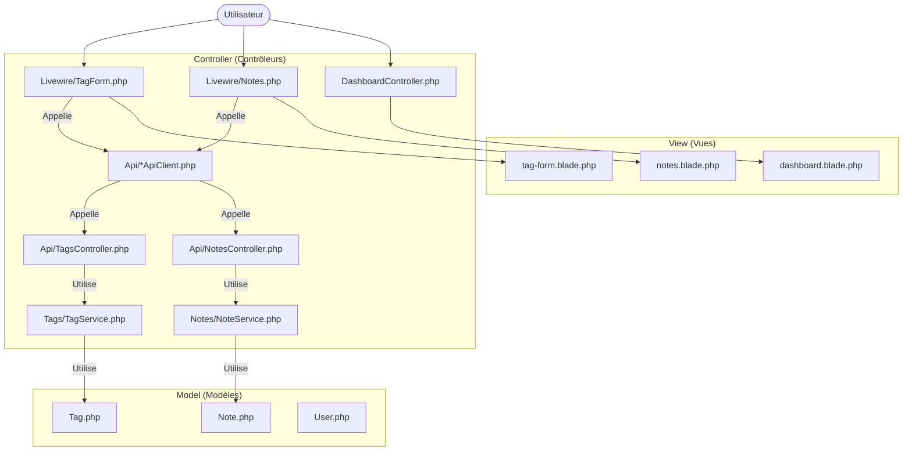

Si nginx est rouge dans herd (car port 80 utilisé par "system" dans windows, c'est IIS):
```bash
sc stop W3SVC
sc config W3SVC start= disabled
```

Ensuite si php artisan ne trouve pas de port,
```bash
where php
```
permet de savoir si le path tombe bien sur le php de Herd et pas de MAMP par exemple

Puis il faut générer une key:
```bash
php artisan key:generate
```


# Transformez l'architecture d'une application existante

# Plot

Renote is an application that allows user to take and store notes.
In renote, a user can:
- create notes
- visualize notes
- define relationship between the notes
- define tags
- and associate a tag to a note.

## Install

1. Install Laravel's Herd:
https://laravel.com/docs/12.x/installation#installation-using-herd

This will install Php, Composer and Laravel.

2. Install node v22

Install node version manager (MVN).
On Windows you can use this distribution:
https://github.com/coreybutler/nvm-windows#readme


3. Clone this project

4. il faut peut-être
```bash
composer install
```

et créer un .env

et migrate les data

```bash
php artisan migrate
```
Pour nettoyer:

```bash
php artisan config:clear
php artisan cache:clear
php artisan config:cache
php artisan route:cache
composer dump-autoload
```

4. Run 

```bash
npm i
```
and 
```bash
npm run dev
```

5. Start Herd

6. Access `http://monolithic-app.test` from your browser

You are setup!

Pour information voici un schéma MVC simplifié:

