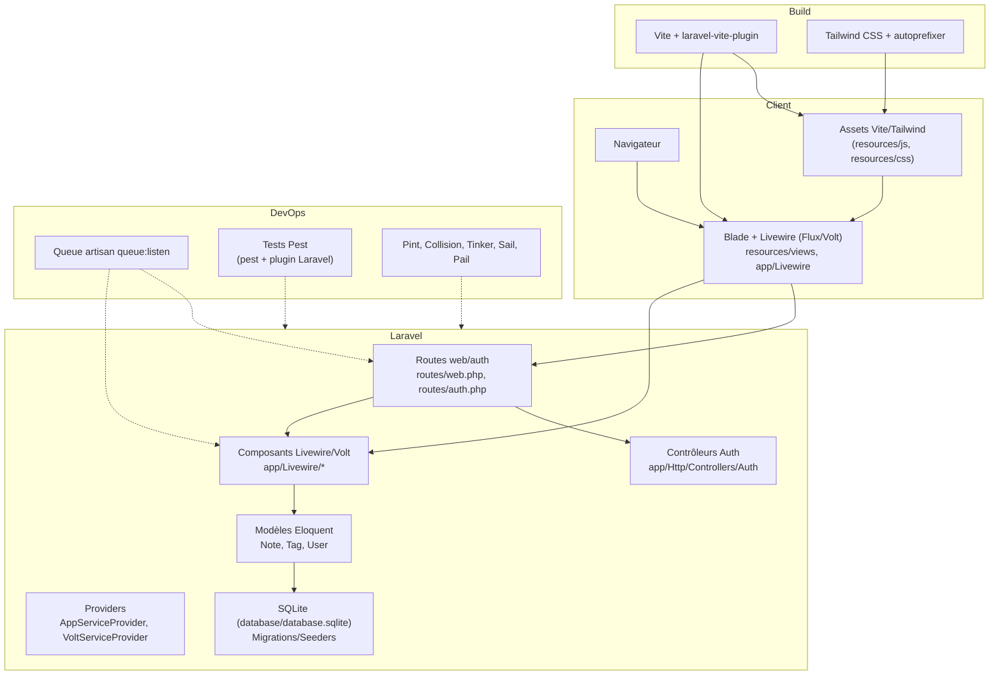

```mermaid
graph TD
    subgraph Client
        Browser["Navigateur"]
        UI["Blade + Livewire (Flux/Volt)\nresources/views, app/Livewire"]
        Assets["Assets Vite/Tailwind\n(resources/js, resources/css)"]
    end

    subgraph Build
        Vite["Vite + laravel-vite-plugin"]
        Tailwind["Tailwind CSS + autoprefixer"]
    end

    subgraph Laravel
        Routes["Routes web/auth\nroutes/web.php, routes/auth.php"]
        Controllers["Contrôleurs Auth\napp/Http/Controllers/Auth"]
        Providers["Providers\nAppServiceProvider, VoltServiceProvider"]
        Livewire["Composants Livewire/Volt\napp/Livewire/*"]
        Eloquent["Modèles Eloquent\nNote, Tag, User"]
        DB["SQLite (database/database.sqlite)\nMigrations/Seeders"]
    end

    subgraph DevOps
        Queue["Queue artisan queue:listen"]
        Tests["Tests Pest\n(pest + plugin Laravel)"]
        Tools["Pint, Collision, Tinker, Sail, Pail"]
    end

    Browser --> UI
    UI --> Routes
    Routes --> Controllers
    Routes --> Livewire
    UI --> Livewire
    Livewire --> Eloquent
    Eloquent --> DB

    Assets --> UI
    Vite --> Assets
    Tailwind --> Assets
    Vite --> UI

    Queue -.-> Routes
    Queue -.-> Livewire

    Tests -.-> Laravel
    Tools -.-> Laravel
```