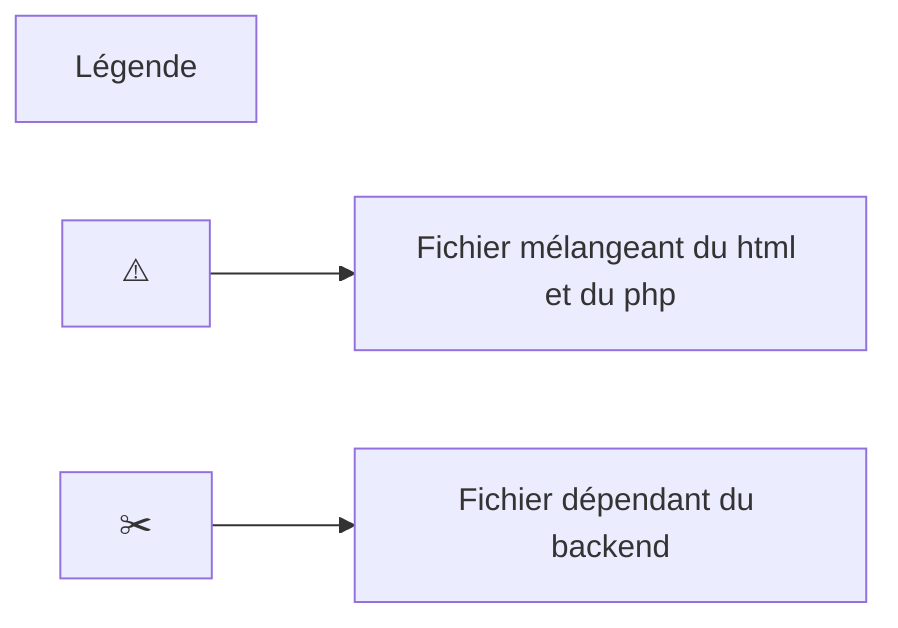
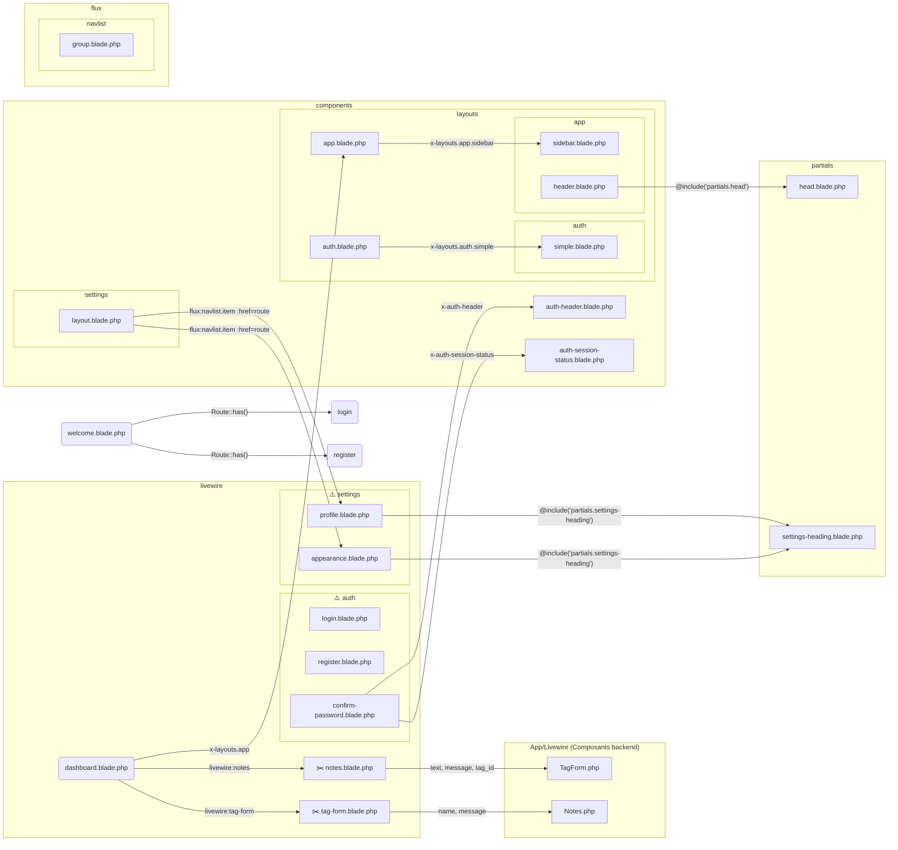

```mermaid
graph LR 
    0[Légende] 
    1[⚠️]
    2[Fichier mélangeant du html et du php]
    1 --> 2  
    3[✂️️]
    4[Fichier dépendant du backend]
    3 --> 4

```

```mermaid
graph LR

    subgraph "components"
        subgraph "layouts"
            C["app.blade.php"]
            Y["auth.blade.php"]
            
            subgraph "app"
                N["sidebar.blade.php"]
                I["header.blade.php"]
            end
            
            %% C -- "Inclut" --> I
            C -- "x-layouts.app.sidebar " --> N

            subgraph "auth"
                X["simple.blade.php"]
            end

            Y -- "x-layouts.auth.simple" --> X
        end

        subgraph "settings"
            R["layout.blade.php"]
        end

        S["auth-header.blade.php"]
        T["auth-session-status.blade.php"]
    end
    
    A(dashboard.blade.php)
    A -- "x-layouts.app" --> C

    subgraph "livewire"
        F["✂️ notes.blade.php"]
        G["✂️ tag-form.blade.php"]

        A -- "livewire:notes" --> F
        A -- "livewire:tag-form" --> G

        subgraph "⚠️ auth"
            J["login.blade.php"]
            O["register.blade.php"]
            V["confirm-password.blade.php"]
        end

        V -- "x-auth-header" --> S
        V -- "x-auth-session-status" --> T

        subgraph "⚠️ settings"
            P["profile.blade.php"]
            W["appearance.blade.php"]
        end

        R -- "flux:navlist.item :href=route" --> P
        R -- "flux:navlist.item :href=route" --> W
    end

    subgraph "partials"
        M["head.blade.php"]
        Q["settings-heading.blade.php"]
    end
    I -- "@include('partials.head')" --> M
    P -- "@include('partials.settings-heading')" --> Q
    W -- "@include('partials.settings-heading')" --> Q

    subgraph "App/Livewire (Composants backend)"
        K[Notes.php]
        L[TagForm.php]
    end
    F -- "text, message, tag_id" --> L
    G -- "name, message" --> K

    %% %% Class Definitions
    %% classDef rootView fill:#E9D5FF,stroke:#6B21A8,stroke-width:2px
    %% classDef layout fill:#A7F3D0,stroke:#047857,stroke-width:2px
    %% classDef partial fill:#FEE2E2,stroke:#DC2626,stroke-width:2px
    %% classDef livewireView fill:#DBEAFE,stroke:#1D4ED8,stroke-width:2px
    %% classDef component fill:#FEF9C3,stroke:#F59E0B,stroke-width:2px
    %% classDef livewireComponent fill:#FCE7F3,stroke:#DB2777,stroke-width:2px

    %% %% Class Assignments
    %% class A,B,D,E rootView
    %% class C,R layout
    %% class M,Q partial
    %% class F,G,J,O,V,P livewireView
    %% class S,T,U,N,I component
    %% class K,L livewireComponent
        
    subgraph "flux"
        subgraph "navlist"
            U["group.blade.php"]
        end
    end

    %% Vues de premier niveau
    B(welcome.blade.php)
    D(login)
    E(register)

    B -- "Route::has()" --> D
    B -- "Route::has()" --> E
```